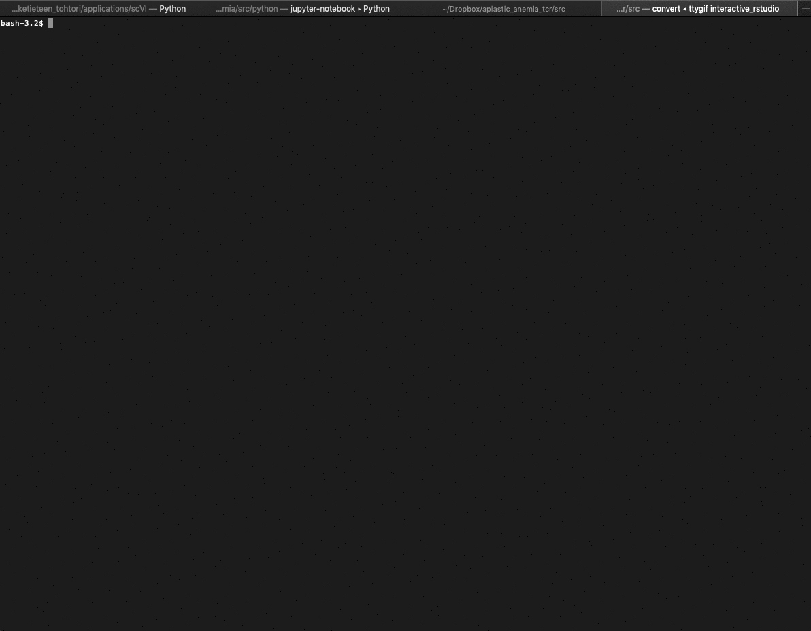

# FIMM cluster instructions for HRUH

Basic Linux knowledge is needed to use the cluster.

## Login

FIMM clusters frontend loggin and address
	
FIMM cluster’s host name is atlas.genome.helsinki.fi  and it can be researched using ssh. Files can be transferred into the system and out from the system through scp. For windows users, a tool called putty (https://www.putty.org/) can be used to access the server and a tool called winSCP (https://winscp.net/eng/download.php) can be used to transfer files. In OSX, one can use terminal for loggin and file transfer. 


At the first login, set up necessary environmental variables

1)	Allow email forwarding by creating a file called .forward. Open the newly created file, type the letter Y and save the file. 	
2)	Set up local location for R packages. Open or creat a file called .bash_profile and add or type a following row:

```export R_LIBS=/homes/<YOUR_USERID>/R```

3)	Set up other environmental variables 


If you forget your password, new one can be set in userportal.giu.fi.

```bash
ssh username@atlas.fimm.fi
```

## Project directories

Don’t use your personal directory as it will fill up quickly.
Common project directory for NGS data analyses:

```bash
/projects/fimm_ngs_mustjoki/
``` 

Create your own subdirectory `<mkdir directoryname>` for separate projects. When you create a new directory, others might not have rights to read/write to the directory. To see which users have permissions to the directory, use

```bash
ls -lha
``` 

r = read w = write x = execute

First 3 letters after d are user (your) permission, 2 nd are group(fimm_ngs_mustjoki), last 3 global (all cluster users)

## Manage permissions using the chmod command:

```bash
chmod -R g+rx /pathtodirectory 
```

Add read and execute permissions to fimm_ngs_mustjoki user group:

* R = recursive, adds same
permissions to all subdirectories
* g = group, to whom the permissions are added (group means fimm_ngs_mustjoki
here)
* +rx = add read and execute permissions (add w for write permissions if needed)

If you want to create a project directory for a specific user group that you can manage
access to, this can be done through the [GIU User Portal](userportal.giu.fi). 

If it is not working, email olle.hansson@helsinki.fi who can create the folder for you


## Copy files to and from the cluster
From your computer to the cluster:

```bash
scp -r /pathonyourcomputer username@atlas.fimm.fi:/pathincluster
```

From the cluster to your computer:

```bash
scp -r username@atlas.fimm.fi:/pathincluster /pathonyourcomputer
```

* r = recursive, will copy the whole directory


## Using screens and running commands in the background

If you want to separate different workflows, you can create screens for each separate thing
you are working on (similar to e.g. separate RStudio sessions). Screens are also useful if
you need to run lon
ger running commands, as the commands run in screens are not
disrupted if you lose the connection. Long-running computations should generally be run
through the job queue, but some jobs such as data downloads/uploads can be run in
screens.

```bash
screen -S nameofscreen #(create new screen)
screen -r nameofscreen #(enter screen)
ctrl + a + d # (exit screen)
screen –list # (list open screens)
screen -X -S nameofscreen kill # (kill screen session)
```
To run a command in the background (enabling you to run other commands while one is running), add & to the end of the command.
Screens are usually used to run commands one needs to monitor, whereas ”automatic” ones can be run in the background.

## Working interactively in a node

If you want to work interactively without using the job queue, you can enter a node and work there without disturbing others in the main node.

First, start a new screen and in the screen, enter a node using ssh. Using the screen is safer if the connection breaks, as then your interactive session will remain in the cluster.

``` 
ssh nameofnode 
ssh compute-16 # an example

```
### Using R and Rstudio interactively

To use R interactively and have plots you produce show up on your screen, install XQuartz on your computer and open SSH connection using:

```
ssh -Y username@atlas.fimm.fi

``` 

First, start a new screen (again safer in case the connection breaks) and in the screen, use R in the command line and the plots will appear on your screen. 

Use the command ```rstudio``` to open Rstudio. It is better to start the screen and use R in a node (not to use the main node). Rstudio is not installed when using a node (located normally in /usr/bin), so Rstudio can currently be used only in the main node (where computationally intensive work should not be done).



## Troubleshooting

* If you can’t login even though you’re sure the password is correct, your personal directory might be full (you might have accidentally filled it up as that directory opens as default when logging in). Delete unneeded files from the directory (login using username@mars.fimm.fi, this will take you to the older Mars cluster through which you can access the same directories). 

* If you get an error message “disk quota exceeded“ when trying to create a new file, try another subdirectory in the project directory or try again later. 

* If you get an error message “Unable to read script file because of error: ERROR! -M option must have argument”, add a file named “.forward” to you home directory and add some text e.g. “Y” in the file. This file is supposed to contain your email address for job reports but no emails are sent even if you have your email in the file.

